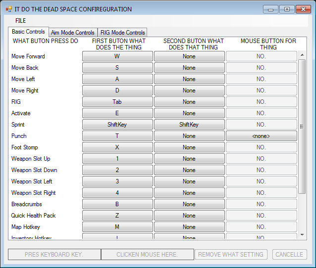

# Dead Space 1 Keybind Editor
Dead Space configuration tool by [felayga](https://github.com/felayga) allows to modify keyboard and mouse binds, accepting arrows and any other keyboard buttons, unlike the game settings do.

{width=50%}

## Limitations:

Manual edits still required to:
- bind wheel or unlock action for mouse binds;
- bind hidden actions, such as map zoom.

See https://www.pcgamingwiki.com/wiki/Dead_Space#Remapping

## Original description

```
deadspacething
==============

Dead Space configuration thing

The game seems to not want to indicate what you can and cannot bind mouse buttons to.
But it's right in the configuration file!
Turns out the list is pretty limited.
Forcing a key to accept mouse input by manual config file editing doesn't work: the bindings are simply ignored.

Despite that, this tool made configuration a fraction less annoying for me.
Enjoy.
```

[Archived](http://web.archive.org/web/20200928104005/https://github.com/felayga/deadspacething)